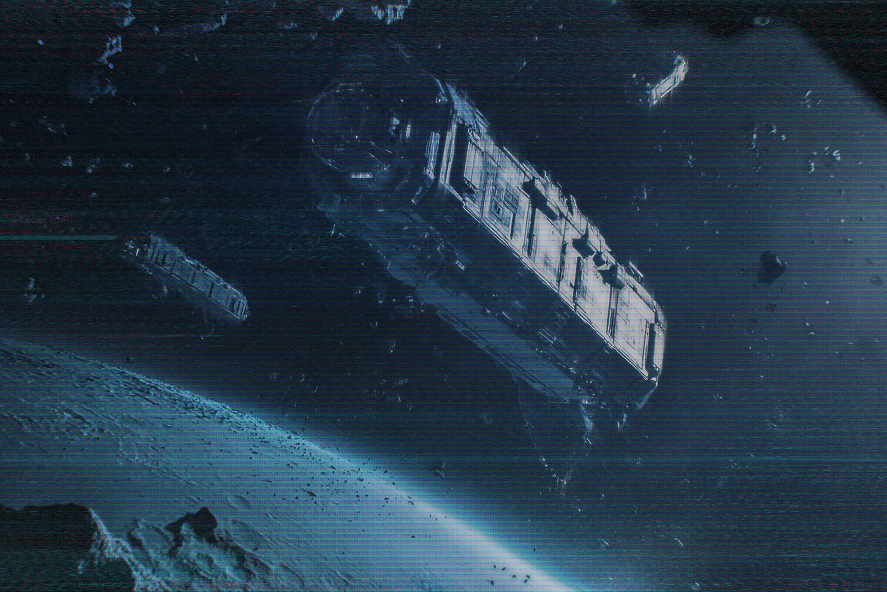

**Secrets of SOYUZ**

Cargo freighter **“Solaris”** has been found in Deep Space Zone 31 near Venus.

The freighter went missing several years ago, allegedly while delivering a weapons shipment from one of the asteroid weapon factories. The point of origin of that shipment has been erased from the navigation logs, authorities say.

Remaining navigational charts suggest that the ship had at some point been passing near **Deimos**, a Martian moon that is part of a “no fly” zone enforced by the Perpetual Council.  

Officer Kamal Sindu, a representative for **Council Security** commented that no crew (or their remains) were found onboard the ship. No further information has been provided so far due to ongoing investigation.     
