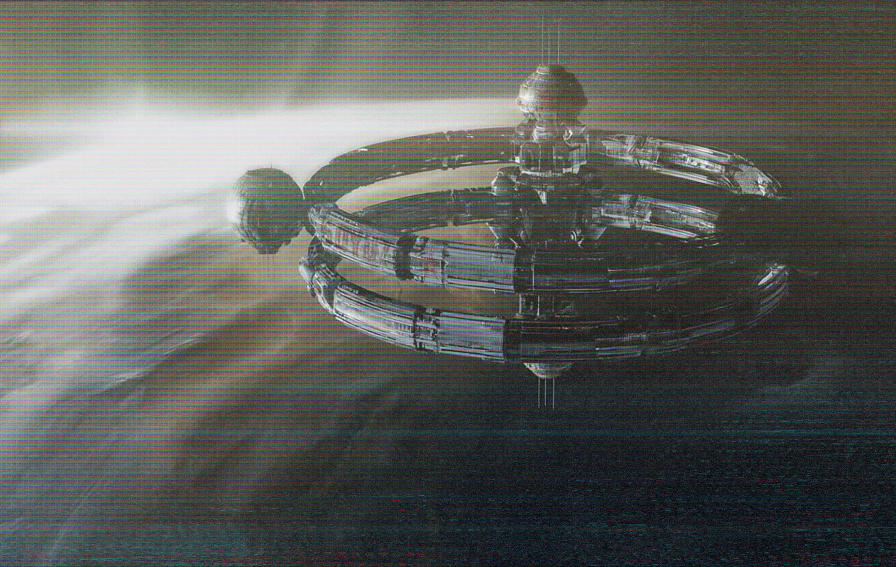

**Generations farm, Astrocrop**

A farming festival has been held on the “Smuglianka” agricultural station. Located near Venus, the station is one of the most favoured tourist attractions in that area of space.

Although officially belonging to SOYUZ, many agricultural companies have their offices on the station, supporting the research of new crops for human space stations and colonies.

One of the scientists - German Titov had something to say on that matter:

“We receive seed materials from all over the solar system. Our experiments are top tier, there is no other place in the known universe that has such advanced research facilities, especially since that incident … Anyway, I am very proud to work here with my colleagues and just would like to thank our comrades from SOYUZ and friends from Astrocrop that provide us with the best bio materials to work on. We promise to make the life of space travellers even better!”
