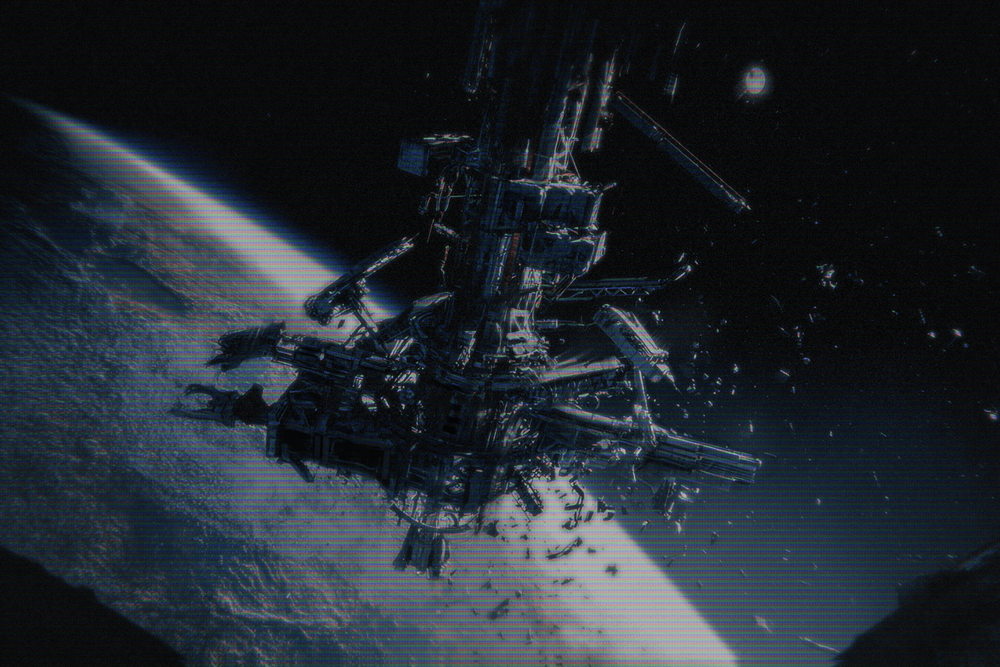

**“Sky Lift”**

Today marks the 6th anniversary of a “drifting lift” - a part of a Sky Lift that has been detached from its planetary foundation. Scientists are still monitoring its orbit, now confirming that it will likely stay in the solar system.

Although the object itself was deemed not dangerous to any colony or major space station, its spin is still somewhat unpredictable, which means any smaller stations or satellites on its path are likely to be in grave danger. 
