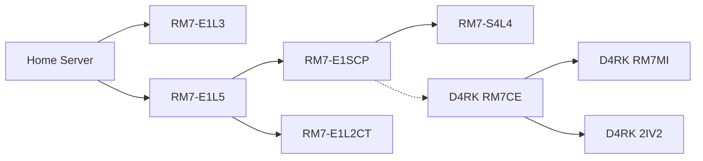

# Network map

## Defense rates
* 5
    * RM7-E1L3
    * RM7-E1L5
    * RM7-S4L4
* 7
    * RM7-E1L2CT
* 12
    * RM7-E1SCP
* 15
    * D4RK RM7CE
    * D4RK RM7MI
* 22
    * D4RK 2IV2

## How it works?
Network Map is your guide into the entirety of the global CORIE net. Its main purpose is to provide a clear visual representation, positioning and dependencies of your "base" network and its surroundings.

Users can use a Network Map to set a destination, also known as an End Point, to a server that they would like to connect to. Sometimes, that would require tunneling through several other servers to reach the End Point - those servers are considered End Points as well.

There could be additional conditions to access various assets on the Network, for example:
* Some websites would only open if you have an established connection (A set End Point) to a specific server.
* Many servers do not have public access, they are considered "private" so accessing them would require fulfilling additional conditions, like, for example, purchasing specialized Software on the Market (or any other specific condition).
* Few servers could be hidden, so to find and access them one would need to use their wit and look for the hints.
* Some servers could only be accessed through hacking of the SAI - Server Administration Interface. By doing so the Hacker would gain access to the main shell that, in turn, grants a user full access to all of the server's contents (Files, Logs, Mails, Sites and so on).

## Unlocking servers
Connecting to `RM7-E1SCP` reveals the server `RM7-S4L4`.

The server `RM7-E1SCP` has a file [sw12_Sec_Report_2341245.txt](/sw12_Sec_Report_2341245.txt.md), which can be downloaded. It is possible to obtain the IP address `855.528.0.4`, which reveals the servers `D4RK RM7CE`, `D4RK RM7MI` and `D4RK 2IV2`.

## Important files
### RM7-E1L2CT
* [Email: From: Chris_Tong.txt](/Email%20From%20Chris_Tong.txt.md)
* [Component_board_tx-71review.txt](/Component_board_tx-71review.txt)
* [Mantis_drone_R4RD(TONG).png](/Mantis_drone_R4RD(TONG).png.jpg)

### RM7-E1SCP
* [sw12_Sec_Report_2341245.txt](/sw12_Sec_Report_2341245.txt.md)

<h2>Technical notes</h2>

Story related files on servers have their `source` as `system`, while all the filler files/logs/addresses have their `source` as `generated`. Files/logs/addresses spawned by a job are coming from `job`, and finally files uploaded – or addresses added – as a part of a job have their `source` as `user`.

